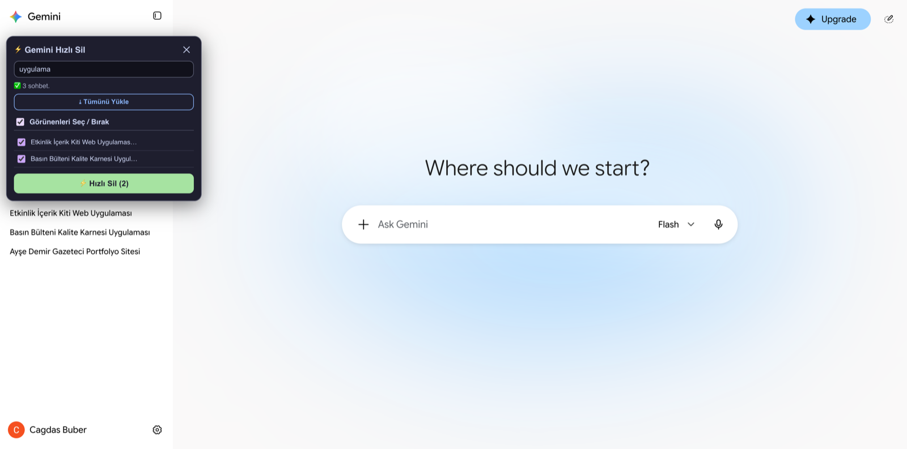

# Gemini Bulk Delete

[Türkçe](README.tr.md)

A bookmarklet that lets you delete many Gemini chats at once.

Gemini only lets you delete chats one by one: open the menu, click
delete, confirm, repeat. This bookmarklet adds a small panel to
gemini.google.com where you can load all your chats, filter them by
title, tick the ones you want and delete them in one go.

## Install

1. Create a new bookmark in your browser (any page, any name).
2. Edit it and replace the URL with the full contents of
   [`bookmarklet.txt`](bookmarklet.txt).
3. Save it, ideally on the bookmarks bar.

If you prefer, you can drag the ready-made button from the
[project page](https://bucagdas.com/proje/gemini-hizli-sil/) to your
bookmarks bar instead.

## Use

1. Open [gemini.google.com](https://gemini.google.com) and sign in.
2. Click the bookmark. A panel opens on the left.
3. Click **Tümünü Yükle** (load all). The panel scrolls through your
   chat list and collects every chat.
4. Type in the filter box to narrow the list by title.
5. Tick chats one by one, or use **Görünenleri Seç / Bırak** to select
   everything currently visible.
6. Click **Hızlı Sil (n)**, confirm the dialog, and wait. The page
   reloads when it is done.

Click the bookmark again, or the ✕ in the corner, to close the panel.

The panel's labels are in Turkish.

## Before you use it

- **Deletion is permanent.** There is no undo. Deleted chats cannot be
  restored, and any public share links made from them stop working.
- **It is unofficial.** Deletion goes through the same internal web
  endpoint the Gemini page itself uses (`batchexecute`, RPC
  `GzXR5e`). It is not a documented API and Google can change it at
  any time, which would break the bookmarklet.
- **Interface language.** Chats are found through the sidebar's "more
  options" buttons, so it works when Gemini's interface is in English
  or Turkish.
- **Speed.** Chats are deleted four at a time with a short pause
  between batches.

## Privacy

Everything runs in your own browser tab, using the session you are
already signed in with. Nothing is sent anywhere except to
gemini.google.com itself.

## Files

- `bookmarklet.txt`: the bookmarklet, ready to paste as a bookmark URL.
- `src/gemini-bulk-delete.js`: the same code, formatted and commented
  for reading.

## License

MIT
